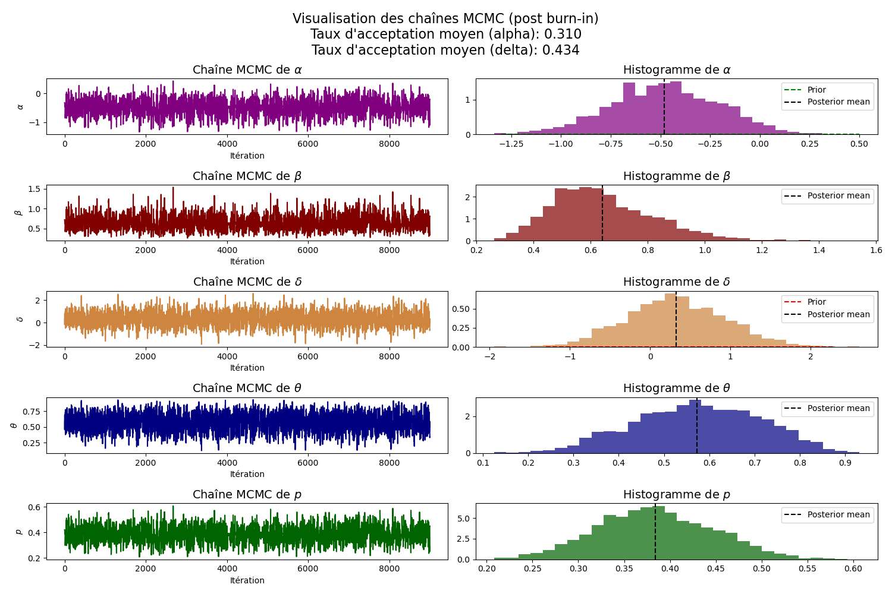

# Hearts : a mixture model for count data

Ce projet implémente des modèles bayésiens pour analyser des données issues de Berry (1987), concernant l'effet d'un médicament sur les patients souffrant de contractions ventriculaires prématurées (PVCs). Chaque patient est observé avant et après le traitement, avec les variables suivantes :
- **xi** : nombre de PVCs avant traitement.
- **yi** : nombre de PVCs après traitement.
- **ti = xi + yi** : somme totale des PVCs observées chez un patient.

Un patient est considéré comme "guéri" si **yi = 0**, mais cela peut survenir par hasard. L'objectif du modèle est de distinguer les patients véritablement guéris de ceux ayant une faible occurrence post-traitement par hasard, tout en évaluant l'effet du traitement chez les patients non guéris.

L’estimation utilise un échantillonnage de Monte Carlo par Chaîne de Markov (MCMC) via
BUGS.

## Illustration



## Fonctionnalités
- Modélisation bayésienne pour distinguer les patients guéris des non-guéris.
- Analyse de l'effet du traitement sur les PVCs.
- Visualisation des résultats.

## Installation
Clonez le dépôt et installez les dépendances nécessaires :
```bash
git clone https://github.com/noesauze/Bayes_heart_mixture_model
cd Bayes_heart_mixture_model
pip install -r requirements.txt
```

